Дудин Артём Евгеньевич, 9ИС-345.

Стиль ближе к Google.

Цель: Закрепить навыки объектно-ориентированного программирования, работы со стандартной библиотекой STL, файлового ввода-вывода, проектирования модульных приложений и обработки пользовательского ввода в среде C++.

Задача: Разработать консольное приложение для автоматизации учёта книжного фонда библиотеки. Программа должна обеспечивать добавление, редактирование, удаление записей о книгах, поиск и фильтрацию каталога, сортировку, расчёт аналитических показателей, а также сохранение и загрузку данных в текстовом формате TXT.

Требования: - Компилятор с поддержкой C++17, Git (опционально).

Инструкция по установке:

Скачать проект, открыть в Visual Studio и запустить.

Структура:

-LibraryApp

--Data

---catalog.txt

--Book.h

--FileIO.h

--Library.h

--Menu.h

--main.cpp

Скриншоты:

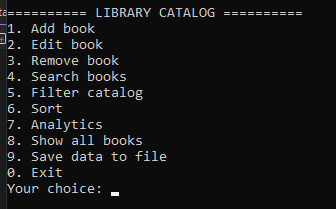

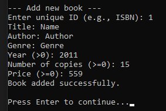

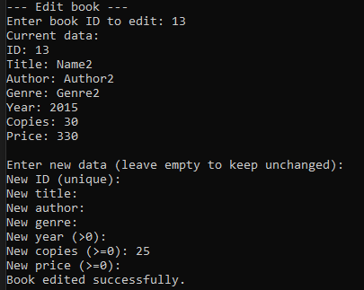

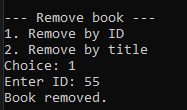

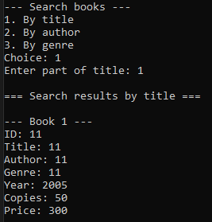

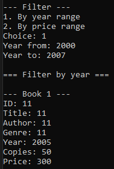

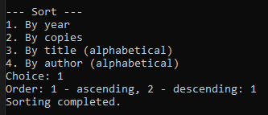

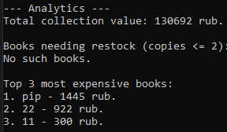

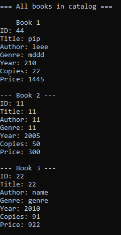

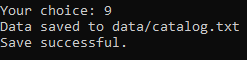

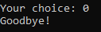

Не разобрался с кодировками, сначала вместо текста были непонятные символы, потом сделал нормальный русский, но при добавлении книг русский текст не отображался, по итогу всё сделал на английском
